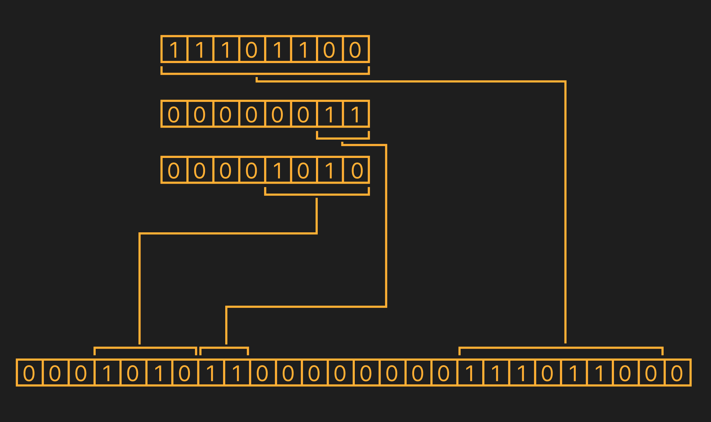

Very simple library for binary printer/parser.



Example simple printer:

```rust
	struct Sample {
		// offset: 0,   bis_size: 6
		field1: u64,
		// offset: 6,   bis_size: 32
		field2: u64,
		// offset: 38,  bis_size: 4
		field3: u64,
		// offset: 42,  bis_size: 64
		field4: u64,
		// offset: 108, bis_size: 6
		field5: u64,
	}

	#[derive(Debug)]
	struct SamplePrinterError {
		field_name: String,
		value: u64,
		max_value: u64,
	}

	impl fmt::Display for SamplePrinterError {
		fn fmt(&self, f: &mut fmt::Formatter<'_>) -> fmt::Result {
			write!(
				f,
				"Error: field '{}' has value {}, which exceeds the maximum value {}.",
				self.field_name, self.value, self.max_value
			)
		}
	}

	impl Error for SamplePrinterError {}


	impl TryInto<[u8; 14]> for Sample {
		type Error = Vec<&'static str>;

		fn try_into(self) -> Result<[u8; 14], Self::Error> {
			/*
				CONVERT values to bytes for passing to the 
				verification function
			*/
			let b_field1 = self.field1.to_be_bytes();
			let b_field2 = self.field2.to_be_bytes();
			let b_field3 = self.field3.to_be_bytes();
			let b_field4 = self.field4.to_be_bytes();
			let b_field5 = self.field5.to_be_bytes();
			/*
				CONVERT END
			*/

			/*
				CHECK that stored values do not go beyond the storage 
				(there are enough bits for encoding)
			*/
			let mut errors = vec![];
			if !is_in_range(6, &b_field1, b_field1.len()) {
				errors.push(SamplePrinterError{
					field_name: "field1".to_string(),
					value: field1,
					max_value: bits_to_max_hold(6) as u64,
				});
			}
			if !is_in_range(32, &b_field2, b_field2.len()) {
				errors.push(SamplePrinterError{
					field_name: "field2".to_string(),
					value: field2,
					max_value: bits_to_max_hold(32) as u64,
				});
			}
			if !is_in_range(4, &b_field3, b_field3.len()) {
				errors.push(SamplePrinterError{
					field_name: "field3".to_string(),
					value: field3,
					max_value: bits_to_max_hold(4) as u64,
				});
			}
			if !is_in_range(64, &b_field4, b_field4.len()) {
				errors.push(SamplePrinterError{
					field_name: "field4".to_string(),
					value: field4,
					max_value: bits_to_max_hold(64) as u64,
				});
			}
			if !is_in_range(6, &b_field5, b_field5.len()) {
				errors.push(SamplePrinterError{
					field_name: "field5".to_string(),
					value: field5,
					max_value: bits_to_max_hold(6) as u64,
				});
			}

			if !errors.is_empty() {
				return Err(errors);
			}
			/*
				CHECK END
			*/

			/*
				WRITE to a byte array
			*/
			let mut target = [0u8; 14];
			let mut offset = 0;

			bit_write(&mut target, offset, 6, &b_field1, b_field1.len());
			offset += 6;

			bit_write(&mut target, offset, 32, &b_field2, b_field2.len());
			offset += 32;

			bit_write(&mut target, offset, 4, &b_field3, b_field3.len());
			offset += 4;

			bit_write(&mut target, offset, 64, &b_field4, b_field4.len());
			offset += 64;

			bit_write(&mut target, offset, 6, &b_field5, b_field5.len());
			/*
				WRITE END
			*/

			Ok(target)
		}
	}
```

Example simple parser:

```rust
	struct Sample {
		// offset: 0,   bis_size: 6
		field1: u64,
		// offset: 6,   bis_size: 32
		field2: u64,
		// offset: 38,  bis_size: 4
		field3: u64,
		// offset: 42,  bis_size: 64
		field4: u64,
		// offset: 108, bis_size: 6
		field5: u64,
	}
	
	impl TryFrom<[u8; 14]> for Sample {
		type Error = ();

		fn try_from(bytes: [u8; 14]) -> Result<Self, Self::Error> {
			let mut offset = 0;

			let mut field1 = [0u8; 8];
			let b_field1_len = field1.len();

			let mut field2 = [0u8; 8];
			let b_field2_len = field2.len();
			
			let mut field3 = [0u8; 8];
			let b_field3_len = field3.len();
			
			let mut field4 = [0u8; 8];
			let b_field4_len = field4.len();
			
			let mut field5 = [0u8; 8];
			let b_field5_len = field5.len();

			bit_read(&bytes, offset, 6, &mut field1, field1_len);
			offset += 6;

			bit_read(&bytes, offset, 32, &mut field2, b_field2_len);
			offset += 32;

			bit_read(&bytes, offset, 4, &mut field3, b_field3_len);
			offset += 4;

			bit_read(&bytes, offset, 64, &mut field4, b_field4_len);
			offset += 64;

			bit_read(&bytes, offset, 6, &mut field5, b_field5_len);

			Ok(Sample {
				field1: u64::from_be_bytes(field1),
				field2: u64::from_be_bytes(field2),
				field3: u64::from_be_bytes(field3),
				field4: u64::from_be_bytes(field4),
				field5: u64::from_be_bytes(field5),
			})
		}
	}

``` 

Interesting `membitcpy` function. This function uses offset for the source as well. In essence, this function can be view as [bidirectional lens](https://www.youtube.com/watch?v=qKnZk27E9Uc), since only with it can both a parser and a printer be implemented:

```rust
// lets parse something

let mut target = [0u8; 2];
let source = u64::from_be_bytes([
	0b00000000, 0b00000000, 0b10011111, 0b11100000, 0b00000000, 
	0b00000000, 0b00000000, 0b00000000,
]);

let b_source = source.to_be_bytes();

let source_bit_offset = 16;
membitcpy(
	&mut target, 
	4, 
	11, 
	&b_source, 
	source_bit_offset,
);

assert_eq!(target, [0b00001001, 0b11111110]);

// now lets print what we parse

let mut new_target = [0u8; 8];

membitcpy(
	&mut new_target,
	8*2,
	11,
	&target,
	4,
);

// here we can see that our new target equivalent 
// our primary source 

assert_eq!(new_target, b_source);

```

Similar libraries:

- https://lib.rs/crates/nom
- https://lib.rs/crates/bitvec
- https://lib.rs/crates/bitstream-io + https://lib.rs/crates/tokio-bitstream-io
- https://lib.rs/crates/bitreader
- https://lib.rs/crates/bitter