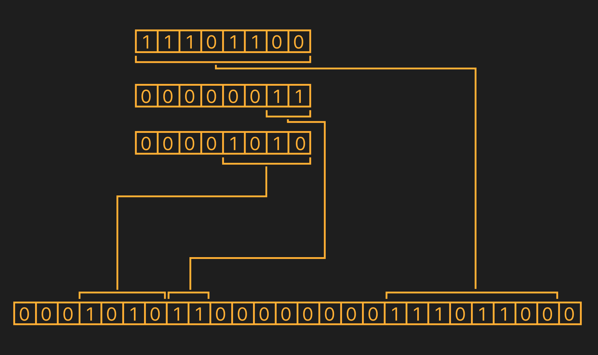

Very simple library for binary serialization/deserialization.



Example simple serialization:

```rust
	struct Sample {
		field1: u64,
		field2: u64,
		field3: u64,
		field4: u64,
		field5: u64,
	}

	impl TryInto<[u8; 14]> for Sample {
		type Error = Vec<&'static str>;

		fn try_into(self) -> Result<[u8; 14], Self::Error> {
			/*
				CONVERT values to bytes for passing to the 
				verification function
			*/
			let b_field1 = self.field1.to_be_bytes();
			let b_field2 = self.field2.to_be_bytes();
			let b_field3 = self.field3.to_be_bytes();
			let b_field4 = self.field4.to_be_bytes();
			let b_field5 = self.field5.to_be_bytes();
			/*
				CONVERT END
			*/

			/*
				CHECK that stored values do not go beyond the storage 
				(there are enough bits for encoding)
			*/
			let mut errors = vec![];
			if !is_in_range(6, &b_field1, b_field1.len()) {
				errors.push("field1");
			}
			if !is_in_range(32, &b_field2, b_field2.len()) {
				errors.push("field2");
			}
			if !is_in_range(4, &b_field3, b_field3.len()) {
				errors.push("field3");
			}
			if !is_in_range(64, &b_field4, b_field4.len()) {
				errors.push("field4");
			}
			if !is_in_range(6, &b_field5, b_field5.len()) {
				errors.push("field5");
			}

			if !errors.is_empty() {
				return Err(errors);
			}
			/*
				CHECK END
			*/

			/*
				WRITE to a byte array
			*/
			let mut target = [0u8; 14];
			let mut offset = 0;

			bit_write(&mut target, offset, 6, &b_field1, b_field1.len());
			offset += 6;

			bit_write(&mut target, offset, 32, &b_field2, b_field2.len());
			offset += 32;

			bit_write(&mut target, offset, 4, &b_field3, b_field3.len());
			offset += 4;

			bit_write(&mut target, offset, 64, &b_field4, b_field4.len());
			offset += 64;

			bit_write(&mut target, offset, 6, &b_field5, b_field5.len());
			/*
				WRITE END
			*/

			Ok(target)
		}
	}
```

Example simple deserialization:

```rust
	//TODO
```

With use codegen macro:

```rust
	//TODO
```
